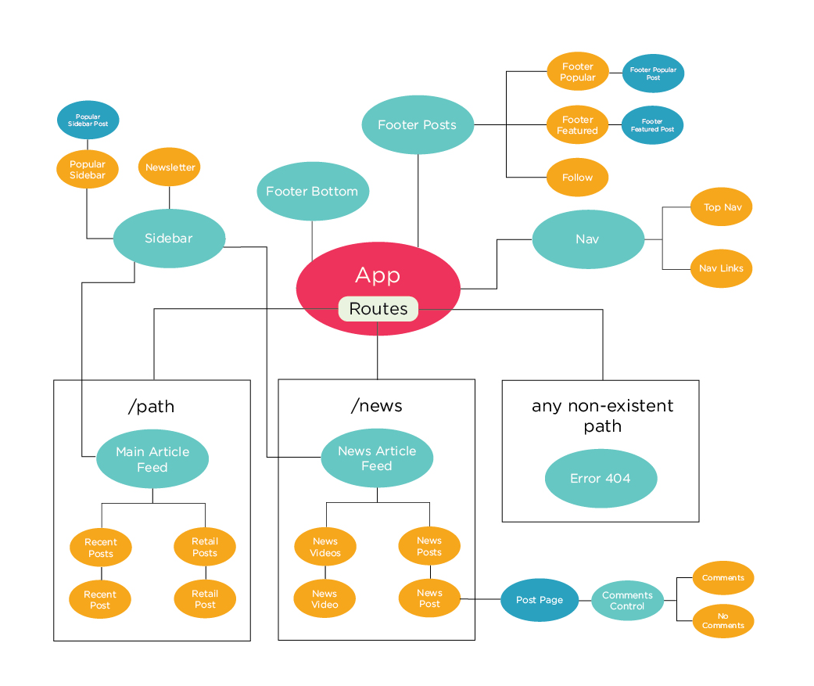

# Angular Makeover

#### React project for Epicodus independent code review, 11.9.18

#### By Nikki Wong

## Description

This application is a React remake of my Angular site rebuild of the Oh My Disney website. In contrast to Angular, building this project involved breaking down each piece of the site into much smaller pieces and heavily considering which individual elements on the page could be reused and how, especially in regard to difference in styling at different parts of the page.

## Angular Clone Site

Live Site: https://site-rebuild-d795b.firebaseapp.com/

## Planning

## Setup on OSX

* Clone this repository
* Run `npm install`

## Development server

Run `npm run start` for a dev server. Navigate to `http://localhost:8080/`. The app will automatically reload if you change any of the source files.

## Technologies Used

* React
* Babel
* Webpack

## Notes
* Had difficulty implementing if conditional
* Many more components than initially planned for
* From additional revisions:
  * Challenge figuring out appropriate use of state for this application
  * No currently working comments section on source site to refer to
  * Would like to later add functionality to add new comments to the comments section

## License

Copyright (c) 2018 **Nikki Wong**
